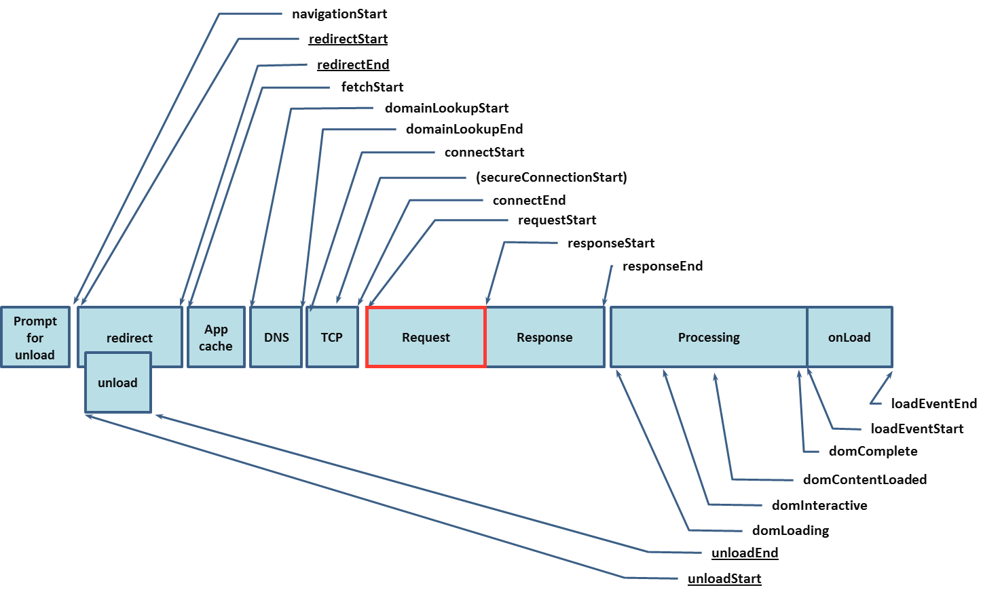

# Server Timing Explained

## What's All This About?
Server Timing allows developers to monitor the performance of server-handling of requests of every resource that makes up a page by extending the Navigation Timing and Resource Timing APIs. The new attributes exposed by Server Timing enable developers to have insight into performance bottlenecks of the `Request` block below, that is, after `requestStart` and before `responseStart`.
 


Adhering to a response header format defined by this specification gives developer tools the ability to visualize backend timers that the developer (or intermediate proxies) deem important. The Javascript API gives analytics vendors the ability to collect and beacon more detailed timing data about each request. 

### Goals
The goal of this API is the standardization of the following:
* a response-header format
* the relationship between server timing data and the Navigation and Resource Timing APIs

### Non-goals
It is _not_ the goal of this API to communicate arbitrary payloads of structured data to the browser. 

It is _not_ the goal of the API to provide a mechanism which relies on clock synchronization (between client, server, or any intermediaries), like providing `startTime`. More discussion [here](https://github.com/w3c/server-timing/issues/10#issuecomment-282442919).

It is _not_ the goal of the API to [distinguish](https://github.com/w3c/server-timing/issues/13) between cached responses and those served by the origin. 

## Getting started
If you are using expressjs, [this](https://www.npmjs.com/package/server-timing) is a nice lightweight wrapper for writing the response headers. 

### Measuring a specific code path
If you want to measure and report on how long it took to validate that a user was authorized to be served "avatar.png", in the response, we’d write headers of the following format:
```
server-timing: auth = 100; authorization check
```

The entry will be available to javascript running in the page on the resource timing entry, like this:
```javascript
const {name, duration, description} = 
  performance.getEntriesByName('<path-to-file>/avatar.png')[0].serverTiming[0];
console.info(name, duration, description); // 'auth', 100, 'authorization check'
```

### Logging *all* Server Timing entries
```javascript
for (const entryType of ['navigation', 'resource']) {
  for (const {name: url, serverTiming} of performance.getEntriesByType(entryType)) {
    for (const {name, duration, description} of serverTiming) {
      console.log('Server Timing entry =',
        JSON.stringify({url, entryType, name, duration, description}, null, 2))
    }
  }
}
```

## Considered alternatives

### Explicitly named metadata parameters:
There was [some discussion](https://github.com/w3c/server-timing/issues/12) about defining `description` as an explicitly named parameter. We investigated alternatives and decided to keep the format simple and more lightweight, to align with original design goals of the API. 

## References & acknowledgements
@yoavweiss, @igrigorik
